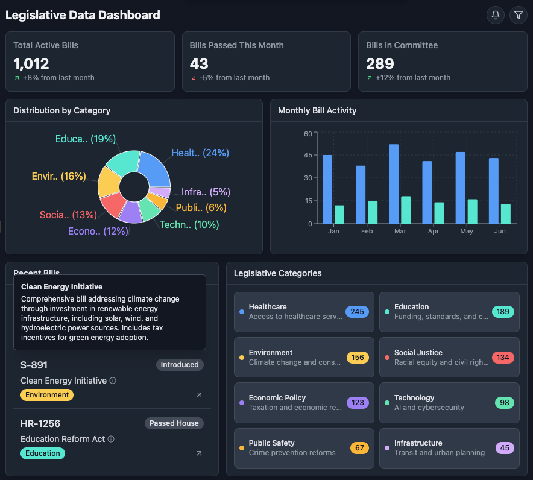
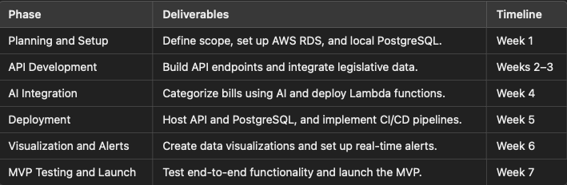

# Billboard - AI (Legislative Data Visualization Tool)

## Overview

The **AI-Powered Legislative Data Visualization Tool** is an interactive platform designed to simplify the complexities of U.S. legislation. It aggregates and categorizes congressional data in real time, offering users a clear and engaging way to track bills from introduction to potential enactment. Key features include:

- **Real-time bill tracking** with status updates at every legislative stage
- **AI-driven topic classification** for streamlined exploration of categories like healthcare, education, environment, and more
- **Insightful visualizations** that reveal legislative trends, outcomes, and policy focus areas

By turning complex data into accessible insights, this tool empowers users to stay informed, explore legislation by topic, and better understand the shifting dynamics of the U.S. legislative process.

## 📊 Sample Dashboard

Below is a mockup of the legislative insights dashboard, illustrating how users can track bill activity by topic and view trends over time.

## 

## Core Features

### Real-time Legislative Updates

- Continuously fetches legislative data using public APIs (ProPublica, GovTrack, and Open States).
- Updates include bill introductions, amendments, and status changes.

### Bill Status Tracking

- Monitor the progress of each bill through various stages:
  - Introduced
  - In Committee
  - Passed by Legislative Bodies
  - Signed into Law or Vetoed

### AI-Powered Bill Categorization

- Uses Natural Language Processing (spaCy, Hugging Face Transformers) to analyze bill titles and summaries.
- Automatically classifies bills into key categories like healthcare, education, environment, and more.

### Comprehensive Categorization

- AI-powered categorization automatically sorts bills into predefined topics such as:
  - **Healthcare**: Access to healthcare services, affordability, and policy improvements.
  - **Education**: Funding, curriculum standards, and educational equity.
  - **Environment**: Climate change, renewable energy, and conservation efforts.
  - **Social Justice**: Addressing racial equity, anti-discrimination, and civil rights.
  - **Economic Policy**: Taxation, labor laws, and economic reforms.
  - **Technology**: AI, cybersecurity, and emerging technologies.
  - **Public Safety**: Crime prevention and law enforcement reforms.
  - **Infrastructure**: Public transit, urban planning, and infrastructure development.

### Interactive Data Visualizations

- Dynamic charts and graphs built with **D3.js** to explore trends such as:
  - Legislative activity by topic.
  - Bill progress over time.
  - Comparison of passed bills vs introduced bills within a given timeframe.

### Custom Alerts

- Users can subscribe to personalized notifications for updates on bills related to topics or keywords (coming soon).

---

## Tech Stack

### Frontend

- **React + Next.js**: For dynamic, server-rendered pages.
- **Tailwind CSS**: For responsive, utility-first design.
- **Redux**: For managing application state.
- **Recharts**: For building complex, data-driven visualizations.

### Backend

- **Node.js + Express.js**: For REST API development.
- **PostgreSQL**: Primary relational database used to store bill metadata and categorization tags.
- **Socket.IO**: For real-time updates to the frontend.

### AI + Natural Languge Processing (NLP)

- **spaCy**: For text preprocessing and named entity recognition.
- **Hugging Face Transformers**: For deep contextual understanding of bill summaries to improve topic classification.

### APIs Used

- **Congress.gov API**: Federal legislative data: bill titles, summaries, sponsorships, and status updates from the U.S. Congress.
- **Open States API**: State-level legislative information: bills, legislators, and committees across all 50 states.

---

## Key Features

### Real-Time Legislative Updates

- Live updates are streamed using **Socket.IO**, ensuring users are always informed.

### AI-Powered Categorization

- **NLP Models**: Bills are analyzed using spaCy and Hugging Face Transformers.

  - Example categorization logic:

    ```javascript
    import spacy from "spacy";
    const nlp = spacy.load("en_core_web_sm");

    const categories = {
      Healthcare: ["health", "medicine", "hospital"],
      "Racial Justice": ["discrimination", "equality"],
      "Economic Inequality": ["poverty", "wealth"],
      "Environmental Justice": ["sustainability", "climate"],
    };

    function categorizeBill(title, summary) {
      const text = `${title} ${summary}`;
      const doc = nlp(text);
      const scores = {};

      for (const [category, keywords] of Object.entries(categories)) {
        scores[category] = keywords.reduce(
          (count, keyword) => count + (text.includes(keyword) ? 1 : 0),
          0
        );
      }

      return Object.keys(scores).reduce((a, b) =>
        scores[a] > scores[b] ? a : b
      );
    }
    ```

### Data Visualizations

- Trends in legislative activity are visualized using **recharts**, highlighting active categories and the progression of bills over time.

### Custom Alerts

- Notifications are managed using **Redux** for state management for scalable alert delivery.

---

## Motivation

This project aims to:

- Promote transparency and accessibility to legislative data.
- Empower users to follow the policies they care about.
- Use machine learning and data visualization to simplify complex legislative datasets.
- Practice scalable full-stack application development without reliance on cloud vendors.

---

## How It Works

1. **Data Collection**: Legislative data is fetched in real-time from Congress.gov and Open States APIs
2. **Categorization**: Bills are analyzed with spaCy and Hugging Face models to identify relevant categories.
3. **Visualization**: Data is processed and visualized with recharts, ensuring users can explore trends dynamically.
4. **State Management**: Redux ensures seamless synchronization of UI components with real-time data.

---

## Road Map



## Setup Instructions

1. Clone the repository:

   ```bash
   git clone https://github.com/your-repo/legislative-visualization-tool.git
   cd legislative-visualization-tool
   ```

2. Install dependencies:

   ```bash
   npm install
   ```

3. Set up environment variables for APIs and AWS credentials in a `.env` file:

   ```env
   CONGRESS_API_KEY=your_congress_api_key
   OPEN_STATES_API_KEY=your_open_states_api_key
   AWS_ACCESS_KEY_ID=your_aws_access_key_id
   AWS_SECRET_ACCESS_KEY=your_aws_secret_access_key
   ```

4. Start the development server:

   ```bash
   npm run dev
   ```

5. Deploy to AWS using your preferred CI/CD pipeline.

---

## Future Enhancements

- Support for multilingual legislative summaries.
- Improved bill recommendation system based on user preferences.
- Integration with civic engagement tools for direct advocacy.
- OAuth-based user authentication and saved alerts.

---

## Contributions

Contributions are welcome! Feel free to open issues or submit pull requests.

---
